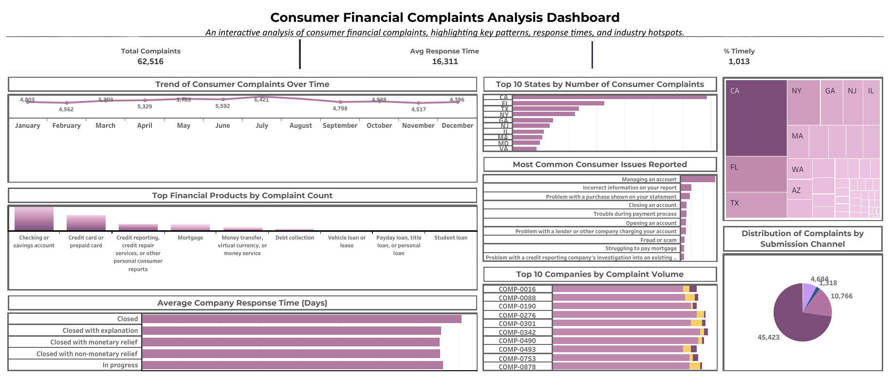

# Consumer Financial Complaints Analysis Dashboard
This project analyzes consumer financial complaints to uncover trends in customer issues, company performance, geographical complaint density, and response patterns. The goal is to derive meaningful insights that can help improve customer service practices and highlight systemic improvement opportunities within the financial services industry.

## Author
**Sneha Ghosh**  
M.Sc. Economics  
[LinkedIn Profile](https://www.linkedin.com/in/sneha-ghosh-98aaa9337)

---

## 📂 Dataset Information

**Dataset:** Consumer Financial Complaints (DataDNA Challenge - October 2025)  
Contains records of consumer complaints related to financial services along with company responses, products involved, and geographic data.

**Key Fields Used:**
| Field | Description |
|------|-------------|
| `Date received` | Date when complaint was filed |
| `Product` | Type of financial product (e.g., Credit Card, Mortgage, etc.) |
| `Issue` | Specific issue raised by customer |
| `Company` | The company the complaint is related to |
| `State` | Where the complaint originated |
| `Timely response?` | Whether the company responded on time |
| `Submitted via` | Submission channel (Web, Phone, Referral, etc.) |

---

## 🛠 Tools Used

| Tool | Purpose |
|-----|---------|
| **Tableau** | Visualization & Dashboard Development |
| **Excel** | Data Preparation, Cleaning & Field Verification |

---

## 📊 Key Charts & Insights

### **1. Product-wise Complaint Distribution (Bar Chart)**
- Helps identify which financial products attract the most customer complaints.
- **Insight:** Specific product categories show significantly higher complaint volumes, revealing potential areas requiring policy or transparency improvements.

### **2. Geographic Complaint Heatmap (Filled Map)**
- Displays complaint concentration across states.
- **Insight:** Certain states show heavier complaint density, potentially due to population size, financial awareness, or company presence.

### **3. Company-wise Complaint Count (Treemap / Bar Chart)**
- Highlights which companies received the highest number of complaints.
- **Insight:** A few companies account for a large portion of total complaints, showing the need for targeted customer support system improvements.

### **4. Response Performance: % Timely Responses (KPI)**
- Measures how effectively companies respond on time.
- **Insight:** Overall response performance reveals responsiveness patterns and customer service reliability.

### **5. Submission Channel Analysis (Donut Chart / Pie Chart)**
- Shows how customers prefer to report complaints.
- **Insight:** Online/web portals dominate submission, indicating digitized customer behavior.

---

## ⭐ Standout Uplifts Implemented

| Enhancement | Purpose |
|-----------|---------|
| Calculated Field: `Number of Records` | Manual record counter to enable flexible aggregations |
| Percentage KPI for Response Timeliness | Helps evaluate service performance instantly |
| Clean Modern Dashboard Layout | Ensures clarity, storytelling, and professional presentation |
| Insight-oriented Titles & Colors | Built to guide decision-makers visually |

---

## 📈 Final Dashboard Outcome

The final dashboard provides:
- Clear understanding of complaint patterns
- Strong comparative company performance evaluation
- Actionable insights for improving customer experience

It aligns with real-world business reporting standards and showcases proficiency in data analysis, visualization, and business insight storytelling.

---

## 💡 Learnings and Skills Demonstrated

- Data Cleaning & Preparation
- Calculated Fields Creation in Tableau (`Number of Records`, Timeliness %)
- Interactive Dashboard Design
- Analytical Insight Narration (Storytelling with Data)
- Professional Presentation Formatting for Recruiter Portfolio

---

## 🔗 Connect With Me

If you'd like to discuss this project, collaborate, or explore data roles together:

**LinkedIn:**  
https://www.linkedin.com/in/sneha-ghosh-98aaa9337

---

Thank you for viewing my project! 😊  
